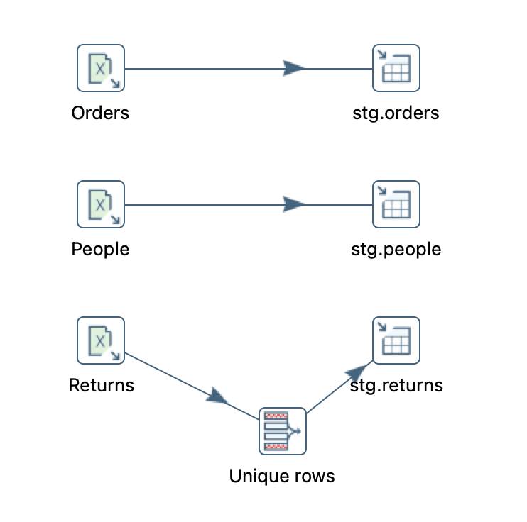
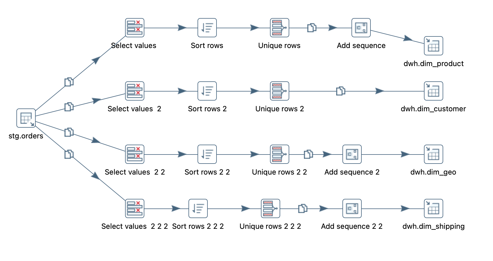
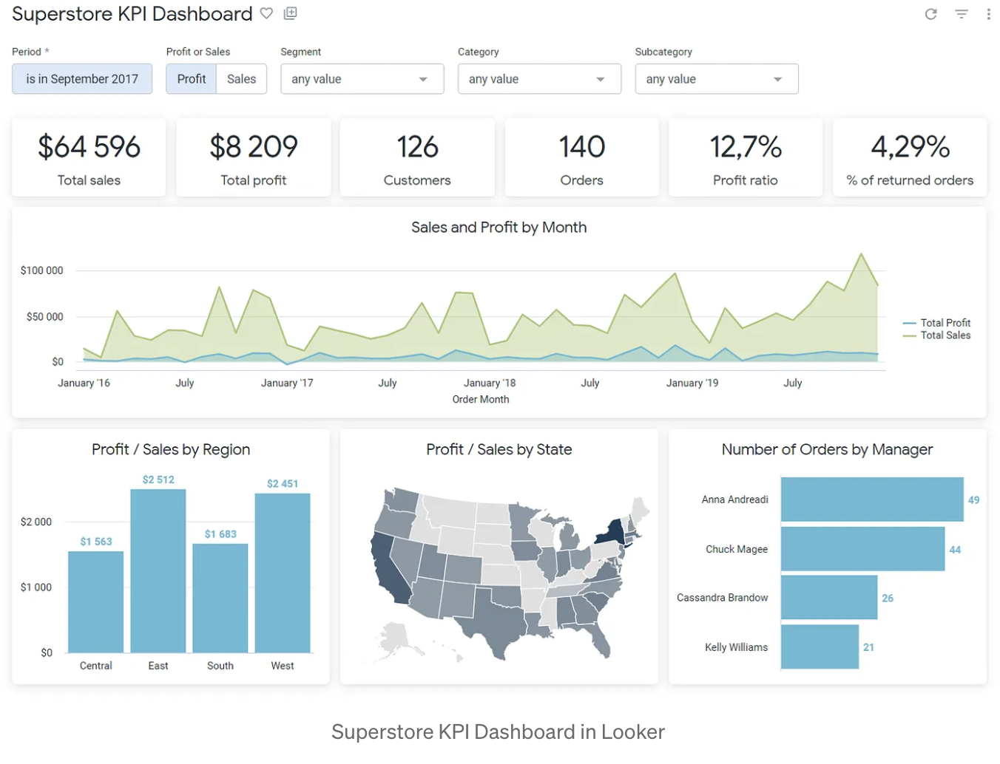

# Azure PostgreSQL & dbt Core


## Overview

This repository showcases an end-to-end data engineering solution focused on **Dimensional Modeling**. The project implements a Star Schema on a remote **Azure PostgreSQL** database to facilitate efficient Business Intelligence and Analytics.

---

## Table of Contents

- [Prerequisites & Tech Stack](#prerequisites--tech-stack)
- [Project Roadmap](#project-roadmap)
- [Phase 1: Environment Setup & Ingestion](#phase-1-environment-setup--ingestion)
- [References](#references)

---

## Prerequisites & Tech Stack

Ensure your local development environment is configured with the following tools:

| Tool | Purpose |
| :--- | :--- |
| Azure Account | PostgreSQL instance hosting |
| Python 3.x | Data ingestion scripts |
| dbt Core | Data transformation |
| VS Code & Git | IDE and version control |
| DBeaver | SQL client for database access |

---

## Project Roadmap

| Week | Focus Area | Description |
| :--- | :--- | :--- |
| **01** | **Setup** | Repository cloning, environment configuration, and initialization |
| **02** | **Ingestion** | Database schema creation and data ingestion (Excel to PostgreSQL) |
| **03** | **Modeling** | Implementing dbt Core and building the Medallion Architecture |
| **04** | **CI/CD** | Pre-commit hooks, GitHub Actions, and incremental refresh strategies |
| **05** | **Silver Layer** | Data Tests |
| **06** | **Gold Layer** | Dim and Fact tables, Data Tests, Documentation |
| **07** | **Schema Management** | Multi-schema architecture, Physical Data Model (ERD), Snapshots | BI tools connection (Looker)

---

## Phase 1: Environment Setup & Ingestion

**Objective:** Initialize the database and ingest raw Excel data into Azure PostgreSQL staging tables.

### 1. Database Initialization

Connect to your Azure PostgreSQL instance using **DBeaver** and create the necessary schemas:

```sql
CREATE SCHEMA IF NOT EXISTS stg;
CREATE SCHEMA IF NOT EXISTS dwh;
```

### 2. Python Environment Setup

Set up a local Python environment for data extraction and loading.

**Create and activate a virtual environment:**

```bash
python -m venv venv
source venv/bin/activate  # On Windows: venv\Scripts\activate
```

**Install dependencies:**

```bash
pip install pandas psycopg2-binary python-dotenv xlrd
```

**Configure environment variables:**

Create a `.env` file in the project root:

```ini
AZURE_PG_HOST=yourserver.postgres.database.azure.com
AZURE_PG_DATABASE=your_database
AZURE_PG_USER=username@yourserver
AZURE_PG_PASSWORD=your_password
```

### 3. Data Ingestion

The project ingests the following raw data files from the `Data/` directory:

| File | Target Table | Description |
| :--- | :--- | :--- |
| `Orders.xls` | `stg.orders` | Sales order data (9,994 rows) |
| `People.xls` | `stg.people` | Regional manager assignments |
| `Returns.xls` | `stg.returns` | Order return records |

**Execute the ingestion script:**

```bash
python ingest_data.py
```

The script performs the following:

- Connects to Azure PostgreSQL via SSL
- Truncates existing data in target tables
- Batch inserts data from Excel files
- Converts date columns to PostgreSQL DATE format

### 4. Validation

Verify the data load by running:

```sql
SELECT COUNT(*) FROM stg.orders;
-- Expected: 9994
```

**Schema Diagrams:**

| Staging Layer | Dimensional Model |
| :---: | :---: |
|  |  |

---
**Objective:** Implement dbt Core with Medallion Architecture (Bronze → Silver → Gold) for modular, testable data transformations.

### 1. dbt Project Structure

```
dbt_superstore/
├── dbt_project.yml          # Project configuration
├── packages.yml             # dbt packages (dbt_utils)
├── models/
│   └── bronze/              # Staging layer
│       ├── sources.yml      # Source definitions
│       ├── schema.yml       # Model tests & documentation
│       ├── stg_orders.sql
│       ├── stg_managers.sql
│       └── stg_returned_orders.sql
└── macros/
    └── cents_to_dollars.sql
```

### 2. Source Configuration

Sources are defined in `models/bronze/sources.yml`:

```yaml
sources:
  - name: superstore
    database: surfalytics_dw_kamil
    schema: stg
    tables:
      - name: orders
      - name: people
      - name: returns
```

### 3. Bronze Layer Models

Each model includes:
- **`dwh_id`**: Unique identifier for data warehouse tracking
- **`etl_timestamp`**: Load timestamp for audit purposes

### 4. Environment Configuration

The project supports multiple environments (dev and prod) via `~/.dbt/profiles.yml`:

#### Week 4: pre-commit and dbt incremental strategies

1. Added pre-commit and github actions.

2. Compared dbt strategy and dbt config: https://docs.getdbt.com/docs/build/incremental-strategy
- creating view
- full table reload

Dbt-postgres supports append, merge, delete+insert.

Please find more info in INCREMENTAL_STRATEGIES_COMPARISON.md

#### Week 5: CI/CD And Profile Management

Added dbt documentation and tests (single, generic, and unit tests).

Updated pre-commit dependencies (Flake8 7.1.1, Black 24.10.0, dbt-checkpoint 2.0.2), added isort for import sorting, disabled sqlfluff auto-fixer for safety.

Improved GitHub Actions with better triggers and error visibility.

 Split dbt profiles into conf/ (prod) and conf_local/ (dev) folders. Now it's possible to test new changes safely without breaking the production.

### Week 6: Seeds, Silver, and Gold Layers

Added `calendar_2025.csv` file using dbt seed functionality.

Created Silver models using this new file.

### Gold Layer

Implements Gold layer Star Schema with 4 dimension tables (`dim_product`, `dim_customer`, `dim_shipping`, `dim_geo`) and 1 fact table (`fct_sales`).

**Key features:**
- Surrogate keys via `dbt_utils.generate_surrogate_key()`
- Window functions: `cumulative_sales_by_customer`, `category_sales_rank`
- NULL handling and duplicate resolution
- 51 data quality tests (all passing)

### Week 7: Schema Management & Physical Data Model

#### Multi-Schema Architecture

Implemented proper schema separation using a custom `generate_schema_name` macro to route models to layer-specific schemas:

| Environment | Bronze | Silver | Gold |
| :--- | :--- | :--- | :--- |
| **Development** | `dev_bronze` | `dev_silver` | `dev_gold` |
| **Production** | `bronze` | `silver` | `gold` |

**Key Changes:**

- **`macros/generate_schema_name.sql`**: Custom macro that dynamically routes models based on their layer configuration and target environment
- **`dbt_project.yml`**: Added `+schema` config for each layer (bronze, silver, gold)
- **`profiles.yml`**: Updated base schema to `dev` for development and `public` for production

#### Physical Data Model (ERD)

Generated Entity-Relationship Diagram using DBeaver to visualize the Star Schema:

| Physical Data Model |
| :---: |
|  |

**Star Schema Components:**

```
                    ┌─────────────────┐
                    │   dim_product   │
                    │─────────────────│
                    │ PK product_sk   │
                    └────────┬────────┘
                             │
┌─────────────────┐          │          ┌─────────────────┐
│  dim_customer   │          │          │   dim_shipping  │
│─────────────────│          │          │─────────────────│
│ PK customer_sk  │          │          │ PK shipping_sk  │
└────────┬────────┘          │          └────────┬────────┘
         │     ┌─────────────┴───────────┐       │
         └─────┤       fct_sales         ├───────┘
               │─────────────────────────│
               │ FK product_sk           │
               │ FK customer_sk          │
               │ FK shipping_sk          │
               │ FK geo_sk               │
               │    sales_amt            │
               │    profit               │
               └─────────────┬───────────┘
                             │
                    ┌────────┴────────┐
                    │     dim_geo     │
                    │─────────────────│
                    │ PK geo_sk       │
                    └─────────────────┘
```

#### dbt Snapshots

Added snapshot functionality for Slowly Changing Dimensions (SCD Type 2) tracking:

```
dbt_superstore/
└── snapshots/
    └── scd_*.sql
```

---

## References

- [Surfalytics - End to End Analytics](https://github.com/surfalytics/end-to-end-analytics)
- [dbt Documentation](https://docs.getdbt.com/)
- [Medallion Architecture](https://www.databricks.com/glossary/medallion-architecture)
